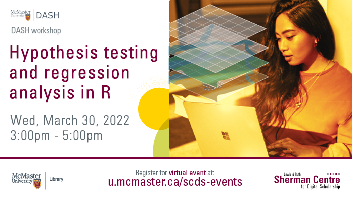

# Welcome to Hypothesis Testing and Regression Analysis in R.
 
In this online module, participants will learn how to conduct hypothesis tests in R, along with correlation and regression analysis. The session will include t test, paired t test, ANOVA, regression, correlation, and covariance. The workshop is open to all who wish to learn about running data analysis in R, however, it is essential to have some prior basic knowledge of the software.

Proceed to the [Preparation](preparation) page to get started.

